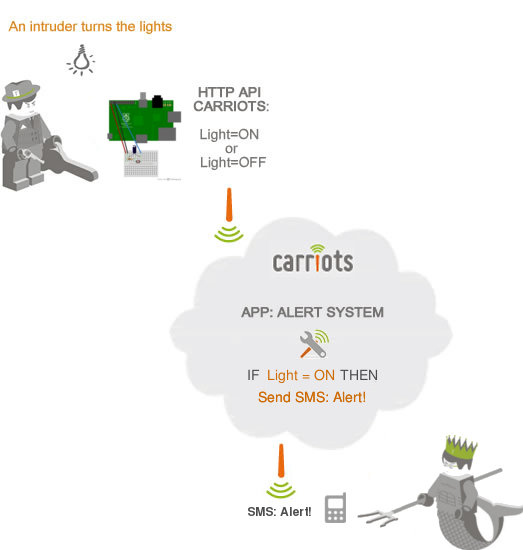
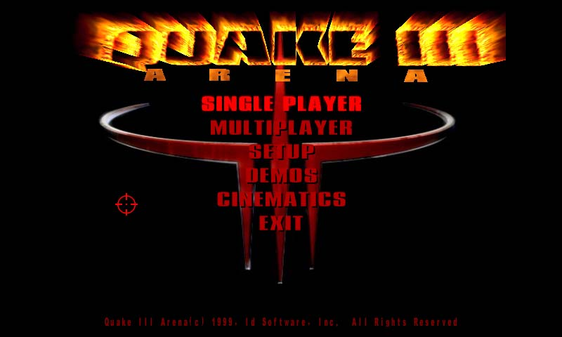
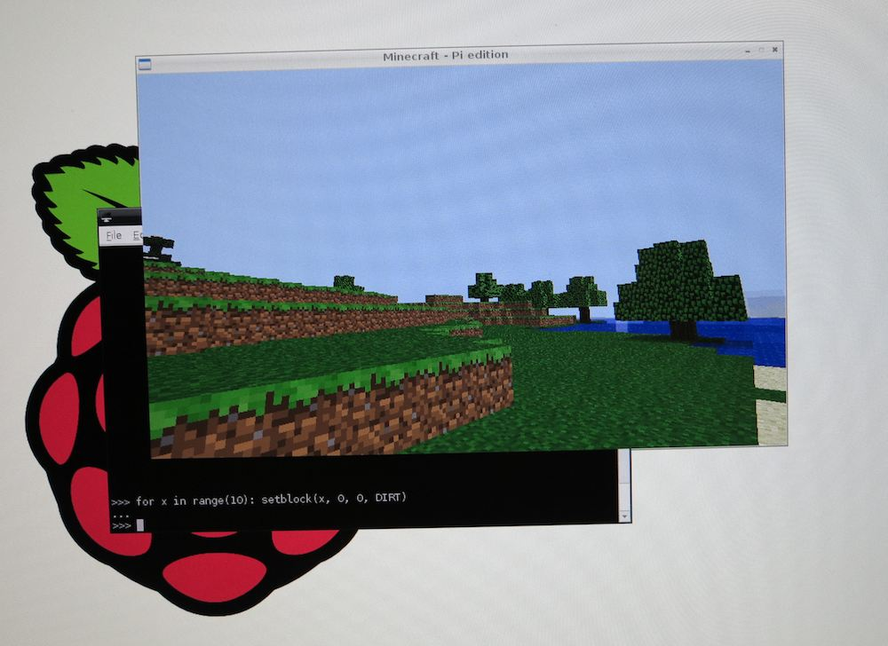
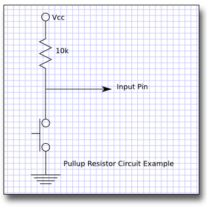

## Introduction to Raspberry Pi
### Matt Nodurfth

## Raspberry Pi Computer
* Cheap, $35 USD
* Powerful
* Linux
* Easy to use with existing parts
* GPIO Pins

## What can be done with a Raspberry Pi?

## Home Automation

## Dynamic Bike Headlight

## Raspbmc

## Games

## Education!

## Let's build this simple circuit

* Connect:
  * Vcc to pin 3.3V
  * Ground to GND
  * Input Pin to pin 25

## Linux
We're using Raspbian, but there are many flavors!

## OK, Let's start!
* User: `pi`
* Password: `raspberry`

What can you see?

###Let's ...
See where we are:
    
    pwd
Look at current directory

    ls
Make a directory
    
    mkdir  MakerFaire
Move around
    
    cd MakerFaire
Make a file
    
    touch game.py

##  Ok, time for the safety of the GUI
    startx

## Let's Code!
* Python
* Ben Croston's RPi.GPIO and John Paulett's stopwatch modules
* Five Second Stadium

<!-- A resistor pulls  a capacitor  up to  5
volts (or what ever your positive supply voltage is if you're using CMOS. Up to
15 volts) Because of the time coefficient of the capacitor  and resistor,  this
takes time to occur. The bigger the capacitor or resistor, the longer it takes.
Placed at the junction of the resitor and capacitor, the momentary press button
pulls the capacitor to ground. It doesn't short out the power supply because of
the resistor. When the switch is made, the voltage on the capacitor falls  away
very  rapidly to  nothing. or  near nothing  depending on  the switch.  (That's
another story and I'll get to that) When the switch is  released the  potential
across  the  capacitor  is  charged  up  again  slowly  by  the  resistor.  The
charge/discharge rate is a smooth logarithmic curve. One faster than the other.
http://www.all-electric.com/schematic/<debounce class="htm"></debounce>
 -->